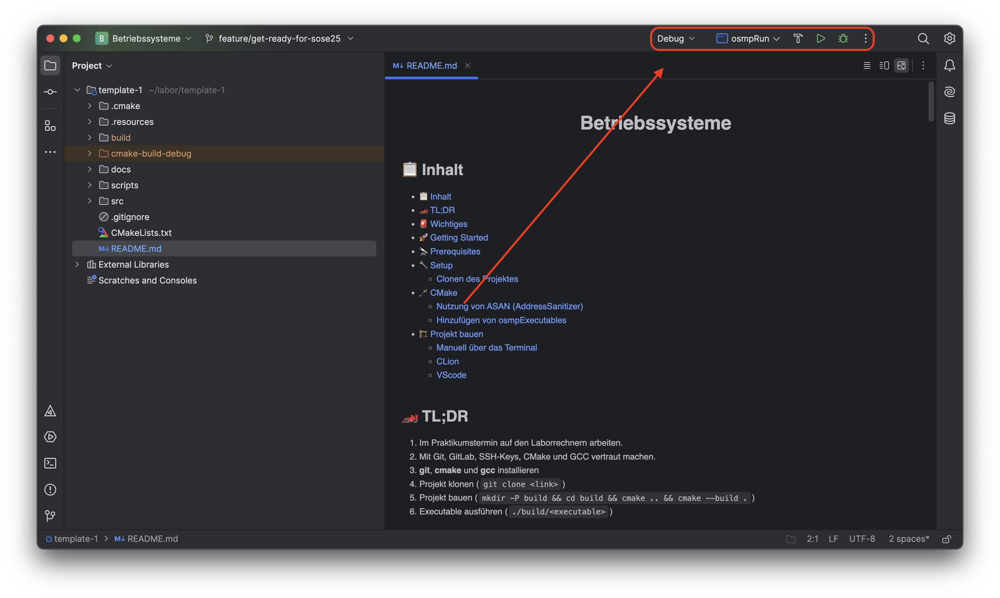
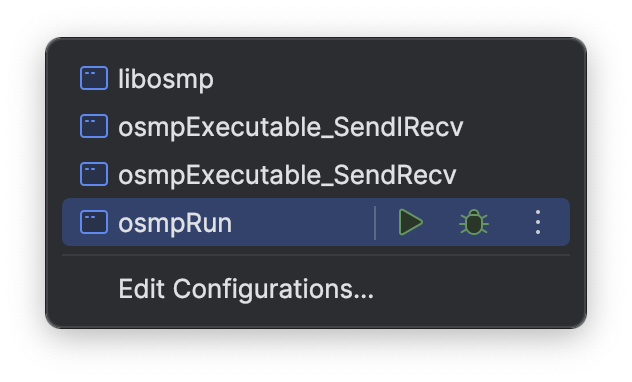
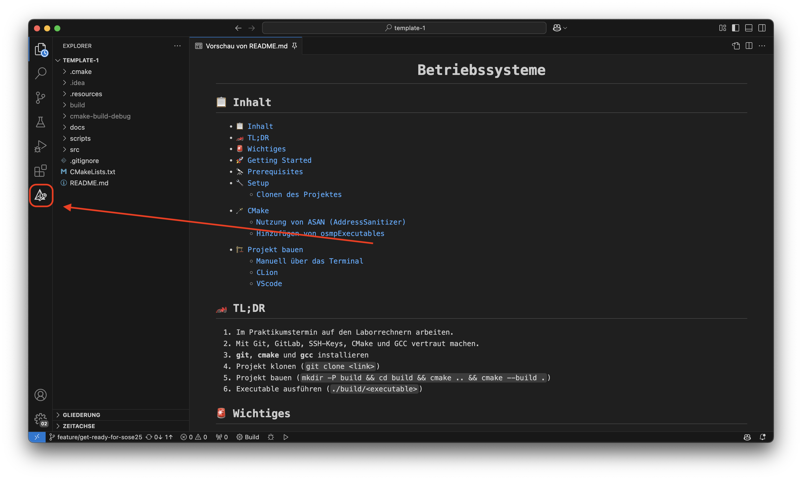
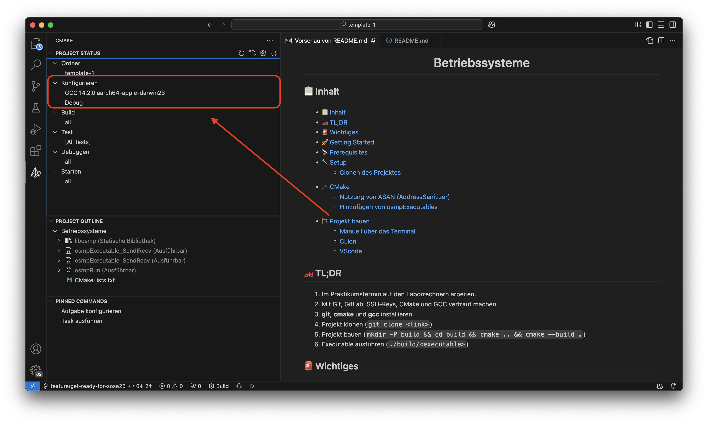
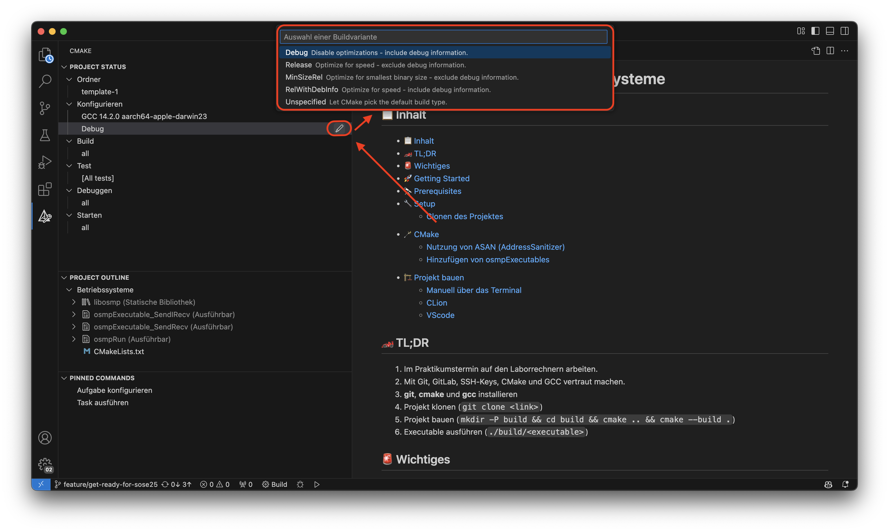
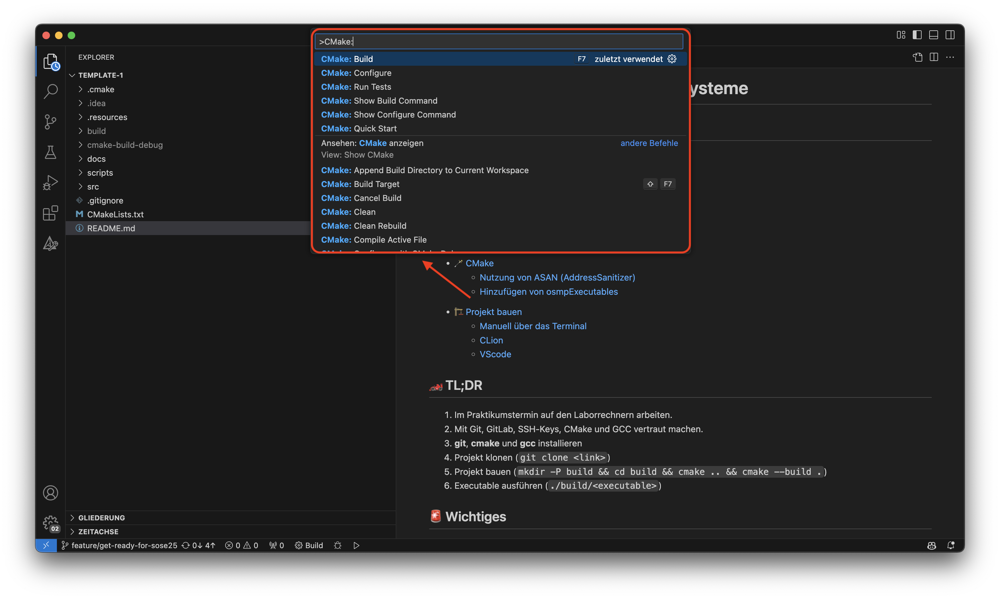

<div align="center">

# Betriebssysteme

</div>

## 📋 Inhalt

- [📋 Inhalt](#-inhalt)
- [🏎️ Rahmenbedingungen](#️-rahmenbedingungen)
- [🚨 Wichtiges](#-wichtiges)
- [🚀 Getting Started](#-getting-started)
- [🔭 Prerequisites](#-prerequisites)
  - [Git](#git)
  - [CMake und GCC](#cmake-und-gcc)
- [🔧 Setup](#-setup)
  - [SSH Keys](#ssh-keys)
  - [Clonen des Projektes](#clonen-des-projektes)
  - [Anfangen zu arbeiten](#anfangen-zu-arbeiten)
- [🪄 CMake](#-cmake)
- [🏗️ Projekt bauen](#️-projekt-bauen)
  - [Projekt manuell über das Terminal bauen](#projekt-manuell-über-das-terminal-bauen)
- [🔍  Sanitizer im Build-Prozess](#--sanitizer-im-build-prozess)
  - [🛠️ Verfügbare Sanitizer](#️-verfügbare-sanitizer)
  - [💡 CMake-Aufrufe zur Konfiguration](#-cmake-aufrufe-zur-konfiguration)
    - [🔁 Ersteinrichtung (außerhalb des Build-Verzeichnisses)](#-ersteinrichtung-außerhalb-des-build-verzeichnisses)
    - [📦 Re-Konfiguration aus dem Build-Verzeichnis](#-re-konfiguration-aus-dem-build-verzeichnis)
  - [🧪 Nutzung von AddressSanitizern](#-nutzung-von-addresssanitizern)
  - [✅ Weitere gültige Kombinationen](#-weitere-gültige-kombinationen)
  - [🧭 Zusätzliche Hinweise](#-zusätzliche-hinweise)
  - [Hinzufügen von osmpExecutables](#hinzufügen-von-osmpexecutables)
  - [CLion](#clion)
  - [VScode](#vscode)

## 🏎️ Rahmenbedingungen

1. Im Praktikumstermin soll auf den Laborrechnern gearbeitet werden.
2. Das Projekt muss auf den Laborrechnern fehlerfrei kompilieren und laufen.
3. Sie können außerhalb ihres Termins nicht auf die Laborrechner zugreifen.
4. Verwenden von Git mit SSH-Key um Quelltexte und Dokumentation im Team zu nutzen.
5. Verwendung von CMake und GCC zum bauen des Projekts.
6. Für Zuhause: **git**, **cmake** und **gcc** installieren
7. Template des Projekts als Basis klonen (`git clone <link>`)
8. Hinweise zum bauen des Projekts in der Anleitung und hier beachten.
9. Zum Testen der implementierten Funktionen passende Executables scheiben und ausführen.

## 🚨 Wichtiges

Obwohl Sie sich mit Ihrer FH-Kennung auch an unseren Rechnern mit dem gewohnten Passwort anmelden können, verwenden wir eigene Homeverzeichnisse, die von eigenen Servern gemountet werden.
Deswegen sind Ihre Dateien nur auf den Betriebssystem-Laborrechnern verfügbar und nicht auf den von anderen Laboren.

Unser Labornetz ist zudem **nicht** von außen nutzbar.
Sorgen Sie also bitte dafür, dass Sie Ihre Dateien zum Ende des Praktikums in Ihrem Git-Repository ablegen.

## 🚀 Getting Started

Auf unseren Laborrechnern ist aktuell Ubuntu 22.04 LTS installiert. Wir
erwarten, dass Ihr Praktikumsprojekt:

- auf diesen Rechnern **fehlerfrei kompiliert**
- und zum Abschluss **fehlerfrei funktioniert**.

Unsere Laborrechner sind für das Praktikum vorbereitet und enthalten
insbesondere von uns geforderte Programme. Zu Beginn sind jedoch einige
persönliche Einstellungen noch zu erledigen, die unter dem Punkt [Setup](#setup)
besprochen werden.

## 🔭 Prerequisites

### Git

Um dieses Projekt lokal zu nutzen, wird Git benötigt, da es uns ermöglicht,
den gesamten Projektcode von GitLab zu klonen/kopieren und Änderungen mit dem
Stand im GitLab zu synchronisieren.

```sh
sudo apt install git
```

Dokumentation, wie Git verwendet wrid bzw. wie das repo geklont werden kann.

### CMake und GCC

Um das Praktikumsprojekt bauen zu können, müssen Sie cmake und gcc installiert haben.

```sh
sudo apt install -y cmake gcc
```

## 🔧 Setup

Stellen Sie sicher, dass Sie alle [prerequisites](#-prerequisites) installiert haben.

Die Versionierung des Praktikums geschieht über das GitLab der FH-Münster.
Um lokal auf einem Rechner an dem Projekt weiterzuentwickeln, muss das Projekt lokal auf den Rechner kopiert werden.

Hilfreich, um git/gitlab kennenzulernen:

- [https://git.fh-muenster.de/help/topics/git/get_started.md](https://git.fh-muenster.de/help/topics/git/get_started.md)
- [https://about.gitlab.com/images/press/git-cheat-sheet.pdf](https://about.gitlab.com/images/press/git-cheat-sheet.pdf)

### SSH Keys

Um Ihr Leben zu erleichtern, sollten Sie ein SSH-Key für GitLab erstellen.
Damit müssen Sie nicht jedes Mal Ihr Passwort eingeben, wenn Sie ein Repository klonen oder aktualisieren.
Dazu finden Sie [hier](https://docs.gitlab.com/ee/user/ssh.html) eine Anleitung, wie Sie ein SSH-Key für das GitLab erstellen.

### Clonen des Projektes

```sh
cd my-folder
git clone ssh://git@git.fh-muenster.de:2323/<link-zum-projekt>.git
cd <projektordner>
```

### Anfangen zu arbeiten

Nachdem Sie das Projekt geklont haben, können Sie anfangen zu arbeiten.
Sie können dieses Repository **vollständig** bearbeiten und anpassen.
Als einzige Bedingung gilt, dass Sie die Struktur des Projektes beibehalten, also die Ordner

- `osmpExecutables` für die OSMP-Executables
- `osmpRunner` für den OSMP-Runner
- `osmpLibrary` für die OSMP-Library

verwenden.
Ansonsten können Sie das Projekt nach Ihren Wünschen anpassen!

**Beispielsweise** können Sie den Parser für die OSMP-Runner Argumente in eine eigene Datei auslagern und dann im osmpRunner über ein `#include "parser.h"` einbinden.

## 🪄 CMake

CMake ist ein Build-System-Generator.
Es erstellt aus einer CMake-Datei (CMakeLists.txt) ein Build-System, das dann genutzt werden kann, um das Projekt zu bauen.

## 🏗️ Projekt bauen

Das Projekt wird mit CMake gebaut. Es lässt sich sowohl mauel im Terminal bauen, als auch mit einer der vorhandenen IDEs.
Auf unseren Rechnern ist u.a. CLion und VS-Code  installiert.

### Projekt manuell über das Terminal bauen

Das Projekt lässt sich wie folgt manuell per CMake bauen

CMake: [https://cmake.org/getting-started/](https://cmake.org/getting-started/)

```sh
cd /pfad/zum/projektordner

# Konfigurieren des Projekts
cmake -S . -B build -D CMAKE_VERBOSE_MAKEFILE=ON

Erzeugt ein neues Buildsystem im Verzeichnis build, basierend auf der CMakeLists.txt im aktuellen Verzeichnis.
Es stellt sicher, dass beim späteren Aufruf von make oder cmake --build alle tatsächlichen Kommandos (wie gcc ...) angezeigt werden.

cmake: Startet das CMake-Programm, um ein Buildsystem zu erzeugen (z. B. Makefiles oder Ninja-Dateien).

-S . : Setzt das Quellverzeichnis (Source Directory), also der Ort, an dem die CMakeLists.txt liegt. Hier: das aktuelle Verzeichnis (.).

-B build: Setzt das Build-Verzeichnis – also der Ort, an dem CMake alle generierten Dateien ablegt (Makefiles, Cache usw.). Hier: das Unterverzeichnis build.
          CMake erzeugt dieses Verzeichnis, falls es nicht existiert.

-D CMAKE_VERBOSE_MAKEFILE=ON: Diese Option setzt die CMake-Variable CMAKE_VERBOSE_MAKEFILE auf ON.
          Das bewirkt, das bei jedem Build der komplette Compiler- und Linker-Befehl ausgegeben wird.


# Bauen der Binaries
cmake --build build
```

## 🔍  Sanitizer im Build-Prozess

Dieses Projekt enthält eine CMake-Funktion `enable_sanitizers(...)`, mit der sich zur Debug-Zeit verschiedene **Sanitizer** aktivieren lassen. Diese helfen dabei, häufige Fehler wie Speicherlecks, undefiniertes Verhalten, Pufferüberläufe oder Datenrennen zur Laufzeit zu erkennen.

### 🛠️ Verfügbare Sanitizer

Die Funktion unterstützt u. a. folgende [GCC 12.3-kompatible](https://gcc.gnu.org/onlinedocs/gcc/Instrumentation-Options.html) Sanitizer (bitte prüfen, ob der verwendete Compiler diese auf Ihrer Plattform unterstützt):

```cmake
function(enable_sanitizers SANITIZER_LIST)
    set(VALID_SANITIZERS
        address leak thread undefined
        bounds bool object-size vla-bound
        shift shift-base
        integer-divide-by-zero float-divide-by-zero
        signed-integer-overflow
        pointer-compare pointer-subtract
        returns-nonnull-attribute nonnull-attribute
        vptr
    )
```

> ⚠️ Hinweis: Der Sanitizer `memory` ist **nicht mit GCC kompatibel** (nur unter Clang und bestimmten Plattformen verfügbar) und wird daher nicht unterstützt.

---

### 💡 CMake-Aufrufe zur Konfiguration

#### 🔁 Ersteinrichtung (außerhalb des Build-Verzeichnisses)

```bash
cmake -S . -B build -D CMAKE_BUILD_TYPE=Debug -DSANITIZER=thread
```

#### 📦 Re-Konfiguration aus dem Build-Verzeichnis

```bash
cd build
cmake ..
```

### 🧪 Nutzung von AddressSanitizern


```bash

# Beispiele für Debug-Builds mit verschiedenen Sanitizern

# Nur Debug-Modus, keine Sanitizer
cmake -DCMAKE_BUILD_TYPE=Debug -DSANITIZER=none ..

# Klassiker: Adressfehler, Speicherlecks, undefiniertes Verhalten
cmake -DCMAKE_BUILD_TYPE=Debug -DSANITIZER=address,leak,undefined ..

# Nur Thread-Sanitizer (Datenrennen)
cmake -DCMAKE_BUILD_TYPE=Debug -DSANITIZER=thread ..

# Laufzeitprüfung Speicherfehler (address), undefiniertem Verhalten (undefined), Speicherlecks (leak),
# Arraygrenzen (bounds), fehlerhaften booleschen Werten (bool) und variablen Längenarrays (vla-bound).
cmake -S . -B build -DCMAKE_BUILD_TYPE=Debug -DSANITIZER=address,undefined,leak,bounds,bool,vla-bound ..

# Kombination mit Pointer-Prüfungen
cmake -DCMAKE_BUILD_TYPE=Debug -DSANITIZER=address,pointer-compare,pointer-subtract ..


```

---

### ✅ Weitere gültige Kombinationen

```bash
# Integer-Division durch 0 und Shift-Fehler erkennen
cmake -DCMAKE_BUILD_TYPE=Debug -DSANITIZER=integer-divide-by-zero,shift ..

# Überlauf von signed ints + Object-Size Checks
cmake -DCMAKE_BUILD_TYPE=Debug -DSANITIZER=signed-integer-overflow,object-size ..

# Erkennung ungültiger Rückgabewerte bei Nonnull-Attributen
cmake -DCMAKE_BUILD_TYPE=Debug -DSANITIZER=nonnull-attribute,returns-nonnull-attribute ..

# Erkennung von Fehlern bei virtuellen Funktionszeigern (C++ only)
cmake -DCMAKE_BUILD_TYPE=Debug -DSANITIZER=vptr ..
```

---

### 🧭 Zusätzliche Hinweise

- Die Option `CMAKE_VERBOSE_MAKEFILE=ON` kann hilfreich sein, um alle Compiler-Flags sichtbar zu machen:

  ```bash
  cmake -DCMAKE_VERBOSE_MAKEFILE=ON ..
  ```

- Der verwendete Compiler und die Plattform bestimmen, welche Kombinationen wirklich funktionieren. **Nicht alle Sanitizer sind unter GCC oder auf jeder Architektur vollständig unterstützt.**

- Die Option `-DSANITIZER=none` deaktiviert explizit alle zusätzlichen Prüfroutinen.


In einer ersten Version gab es die Möglichkeit den Sanitizer ASAN nur mit "OFF" und "ON" zu konfigurieren. Die Funktion ist zwar noch
vorhanden, wir empfehlen aber die erweiterten Möglichkeiten mit mehreren Sanitizern zu nutzen.
Sie haben die Möglichkeit, den [AddressSanitizer](https://github.com/google/sanitizers/wiki/addresssanitizer) (ASAN) zu nutzen, um Speicherfehler zu finden.
ASAN ist ein Werkzeug, das in modernen GCC- und Clang-Compilern enthalten ist.
Es kann verwendet werden, um Speicherfehler wie Buffer Overflows, Undefiniertes Verhalten und Speicherlecks zu finden.

```cmake title="CMakeLists.txt"
#== ASAN ==#
# Ändern Sie den Wert von "OFF" zu "ON", um AddressSanitizer zu aktivieren
option(USE_ASAN "AddressSanitizer aktivieren" OFF)
compile_with_asan(${USE_ASAN})
```

Um ASAN zu nutzen, müssten die obenstehenden Zeilen zur CMakeFile.txt hinzugefügt werden und die CMake-Variable `USE_ASAN` auf `ON` gesetzt weren.

Dazu können Sie entweder die Variable in der CMakeLists.txt setzen oder beim Aufruf von CMake die Variable setzen (z. B. `cmake -DUSE_ASAN=ON ...`).

### Hinzufügen von osmpExecutables

Um eine Executable hinzuzufügen, muss die [CMakeLists.txt](./CMakeLists.txt) bearbeitet werden. Hier finden Sie folgende Zeilen:

```cmake title="CMakeLists.txt"
#== Executables ==#
set(EXECUTABLES
    NAME osmprun
    SOURCES src/osmpRunner/osmpRun.c src/osmpRunner/osmpRun.h
    NAME echoall
    SOURCES src/osmpExecutables/echoAll.c
    # Neue Executables hier einfügen
    # NAME <name>
    # SOURCES <source1> <source2> ...
)
```

Hier müssen Sie den

- **NAME** (Der Name Executable) und die
- **SOURCES** (Die benötigten source-Dateien Leerzeichen separiert)

in folgendem Format hinzufügen:

```cmake
NAME <Name der Executable>
SOURCES <Source-Dateien>
```

Über den Namen steuern Sie, wie die ausführbare Datei heißt.
Diese Datei werden Sie dann in dem build Ordner finden (z. B. "build", "cmake-build-debug" oder "cmake-build-release").


### CLion

Nachdem Sie das Projekt in CLion geöffnet haben, sehen sie oben rechts folgendes:

{ width=500px }

Hier können Sie, indem Sie auf `osmpRun` klicke, die Executable auswählen, die Sie bauen möchten.

{ width=500px }

### VScode

Installieren Sie folgende Extensions:

- C/C++ Extension Pack

Gehen Sie in die Kommando-Palette (CMD/CTRL + SHIFT + P) und suchen Sie nach
`CMake: Konfigurieren`. Hier wählen Sie die entsprechende CMakeLists.txt Datei
aus.

Nun können Sie auf die CMake Extension (in dem Linken Reiter) gehen.

{ width=500px }

Jetzt sollten Sie etwas ähnliches zu dem folgenden Bild sehen.

{ width=500px }

Hier können Sie bei `Debug` die Build-Variante konfigurieren

{ width=500px }

Und nun können Sie in der Kommando-Palette mit `CMake: Build` die Executables bauen.

{ width=500px }

<div align="right" style="text-align: right">

[(nach oben)](#betriebssysteme)

</div>
