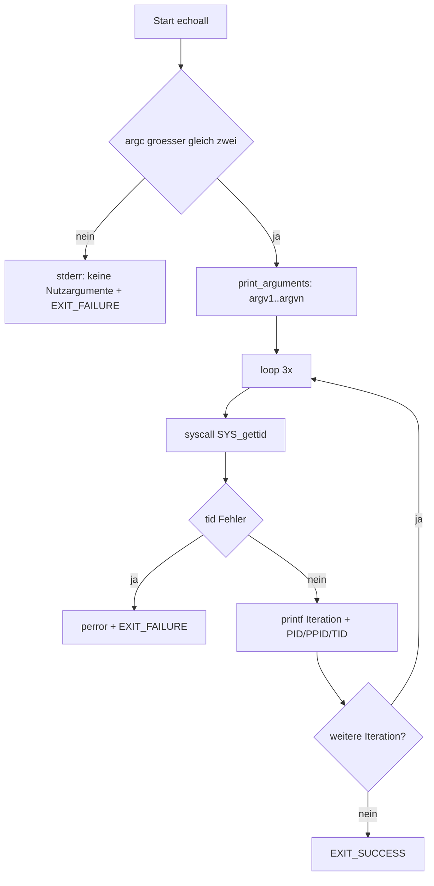
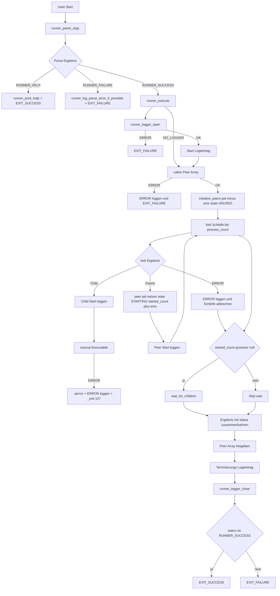

# Termin 1

## 1. Build

```bash
./build.sh
```

### 2 echoall

Aufruf:

```bash
./build/echoall arg1 arg2 ...
```

Verhalten:

- Gibt alle uebergebenen Argumente (`argv[1]..argv[n]`) nummeriert aus.
- Gibt 3-mal `PID`, `PPID` und `TID` aus.
- Bricht mit Fehlermeldung ab, wenn keine Nutzargumente uebergeben wurden.

Beispiel:

```bash
./build/echoall hello world
```


### 2.1 echoall



### 3 osmprun

Aufruf:

```bash
./build/osmprun -p ProzessCount [-l Logfile] [-v 0..3] -e Executable [Argumente...]
./build/osmprun -h
```

### 3.1 osmprun



# 4 Test

Auszug:

2026-04-01T23:47:43 1 204452 [RUNNER] Starte 50 Peers mit Executable './build/echoall'.
2026-04-01T23:47:43 2 204452 [RUNNER] Speicher fuer 50 Peer-Eintraege reserviert
2026-04-01T23:47:43 2 204452 [RUNNER] Peer 0 gestartet mit PID 204453
2026-04-01T23:47:43 2 204452 [RUNNER] Peer 1 gestartet mit PID 204454
2026-04-01T23:47:43 2 204453 [PEER 0] Child startet exec './build/echoall'
2026-04-01T23:47:43 2 204452 [RUNNER] Peer 2 gestartet mit PID 204455
2026-04-01T23:47:43 2 204454 [PEER 1] Child startet exec './build/echoall'
2026-04-01T23:47:43 2 204452 [RUNNER] Peer 3 gestartet mit PID 204456
2026-04-01T23:47:43 2 204455 [PEER 2] Child startet exec './build/echoall'
2026-04-01T23:47:43 2 204452 [RUNNER] Peer 4 gestartet mit PID 204457
2026-04-01T23:47:43 2 204456 [PEER 3] Child startet exec './build/echoall'
2026-04-01T23:47:43 2 204452 [RUNNER] Peer 5 gestartet mit PID 204458
...
2026-04-01T23:47:43 2 204538 [PEER 47] Child startet exec './build/echoall'
2026-04-01T23:47:43 2 204540 [PEER 48] Child startet exec './build/echoall'
2026-04-01T23:47:43 2 204452 [RUNNER] Peer 49 gestartet mit PID 204545
2026-04-01T23:47:43 2 204452 [RUNNER] Peer PID 204453 beendet mit Exit-Code 0
2026-04-01T23:47:43 2 204452 [RUNNER] Peer PID 204454 beendet mit Exit-Code 0
...
2026-04-01T23:47:43 2 204452 [RUNNER] Peer PID 204540 beendet mit Exit-Code 0
2026-04-01T23:47:43 2 204452 [RUNNER] Peer PID 204545 beendet mit Exit-Code 0
2026-04-01T23:47:43 2 204452 [RUNNER] Gebe Peer-Array frei
2026-04-01T23:47:43 1 204452 [RUNNER] Terminierung abgeschlossen
